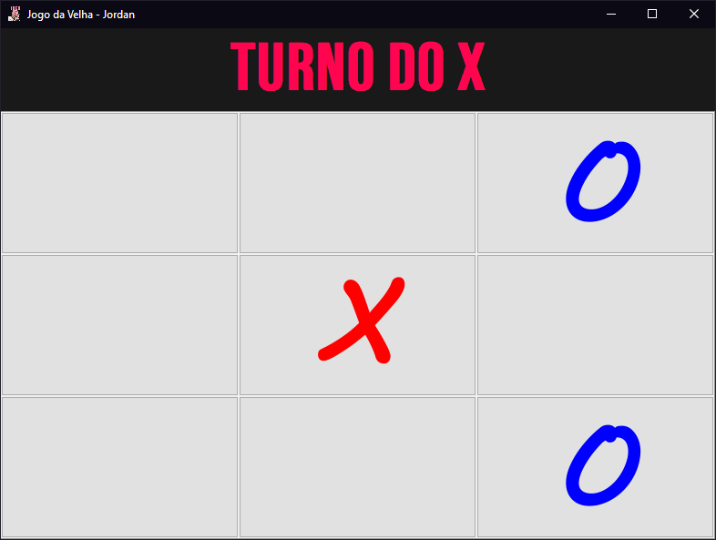

<h1 align="center">
  🎮<br>My Java Games
</h1>

*Read this in other languages: [English](readme.md), [Portuguese](readme.pt.md), [한국어](readme.ko.md), [日本語](readme.ja.md), [简体中文](readme.zh-cn.md), [正體中文](readme.zh-tw.md).*: 

<h4 align="center">
  Games Developed In Java.
</h4>

<h4 align="center"><a href="https://github.com/JordanCampos20/MyJavaGames/archive/refs/heads/main.zip">Click to download project</a></h4>

---

## Games
<p style="height: 400px" align="center"></p>

```
Extensionist Work I - TicTacToe Developed in Java with System Level
```

<!-- <p align="center"></p>

```
Example
``` -->


## Installation
```
git clone https://github.com/JordanCampos20/MyJavaGames.git
```

## Running

```
Run the "Index.java" file for open game
```

---

## 💼 Technologies used
For the development of this application I used the following technologies:

- IntelliJ IDEA, Java OpenJDK==17.0.2;

---


## 🦄 Author<br>
<table>
  <tr>
    <td align="center">
      <a href="https://github.com/JordanCampos20">
        <br>
        <sub>
          <b>Jordan C.</b>
        </sub>
      </a>
    </td>
  </tr>
</table>

---
